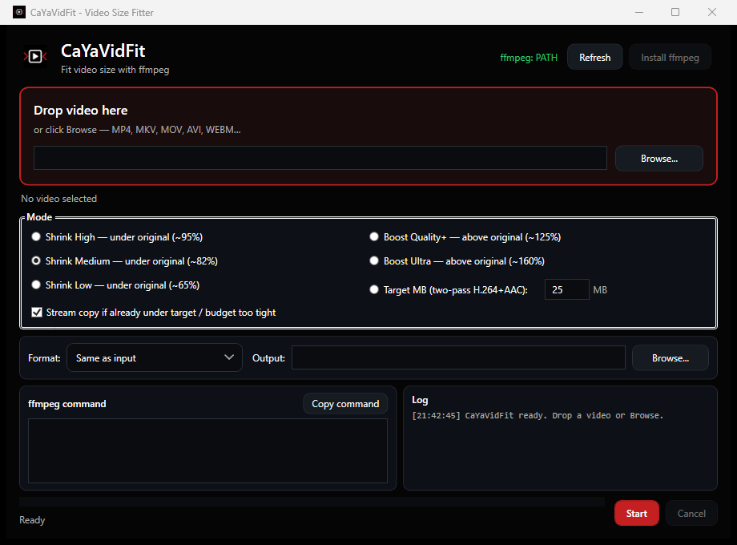

# CaYaVidFit

<p align="center">
  
</p>

<p align="center">
  <strong>Windows video boyut ayarlayıcı</strong> — <strong>ffmpeg</strong> (WPF / .NET 8).<br/>
  Videoyu sürükleyip bırakın, küçültme veya artırma preset’i (veya <strong>hedef MB</strong>) seçin, formatı belirleyin, kodlayın.<br/>
  <strong>Tek dosya</strong> self-contained <code>.exe</code> — hedef PC’de .NET kurulumu gerekmez.
</p>

<p align="center">
  
</p>

<p align="center">
  <a href="https://github.com/CaYatur/CaYaVidFit/releases"></a>
  <a href="https://github.com/CaYatur/CaYaVidFit/releases"></a>
  <a href="LICENSE"></a>
  <a href="https://cayadev.com"></a>
</p>


> English: [README.md](README.md) · Marka: [cayadev.com](https://cayadev.com)

## İndirme

En güncel taşınabilir sürüm: **[Releases](https://github.com/CaYatur/CaYaVidFit/releases)**.

1. `CaYaVidFit.exe` indirin
2. Çalıştırın (SmartScreen çıkarsa ve kaynağa güveniyorsanız *Ek bilgi* → *Yine de çalıştır*)
3. ffmpeg yoksa üstteki **ffmpeg Kur** ile kurun

## Ne işe yarar?

Günlük “dosya yükleme / sohbet / mail için çok büyük” senaryoları için:

- Orijinal boyuta göre **garanti küçültme** (shrink)
- İsteğe bağlı **kalite / boyut artırma** (boost)
- **Hedef MB** ile iki geçişli H.264 + AAC
- **Aynı konteyner** veya MP4 / MKV / MOV / WEBM / AVI
- Tam ffmpeg komutunu görüp kopyalama

Tam bir video editörü değildir.

## Özellikler (özet)

| Mod | Davranış |
|-----|----------|
| Küçült Yüksek (~%95) | Boyut tavanı ≈ orijinalin %95’i |
| Küçült Orta (~%82) | Varsayılan |
| Küçült Düşük (~%65) | En agresif küçültme preset’i |
| Artır Kalite+ (~%125) | Bütçe ≈ %125 |
| Artır Ultra (~%160) | Bütçe ≈ %160 |
| Hedef MB | Seçilen MB için bitrate planı + iki geçiş |

Küçültme preset’leri **orijinalden büyük üretmemek** için tasarlandı (boyut tavanlı iki geçiş). Düz CRF bazen dosyayı büyütebilir; bu yüzden burada kullanılmaz.

Diğerleri: sürükle-bırak overlay, girdi/çıktı Gözat, stream copy seçeneği, CaYaDev koyu tema, EN/TR (OS diline göre), `CAYAVIDFIT_LANG` ile zorla dil.

```powershell
$env:CAYAVIDFIT_LANG = "tr-TR"
.\CaYaVidFit.exe
```

## Gereksinimler

- Windows x64
- ffmpeg + ffprobe (PATH veya `./ffmpeg/`; uygulama kurabilir)

## Kaynaktan derleme

```powershell
cd CaYaVidFit
dotnet run --project .\src\CaYaVidFit\CaYaVidFit.csproj

dotnet publish .\src\CaYaVidFit\CaYaVidFit.csproj `
  -c Release -r win-x64 --self-contained true `
  -p:PublishSingleFile=true `
  -p:IncludeNativeLibrariesForSelfExtract=true `
  -o .\dist
```

veya `.\tools\Publish.ps1`

## Sorun giderme

- Sessiz kapanma → Masaüstünde `CaYaVidFit_crash.txt`
- ffmpeg eksik → uygulama içi kurulum veya PATH
- Küçültme büyütüyorsa → Releases’ten güncel sürümü alın

## Lisans

MIT — [LICENSE](LICENSE).

[CaYaDev](https://cayadev.com) / Çağan Turgut.
